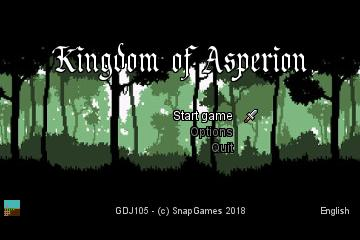
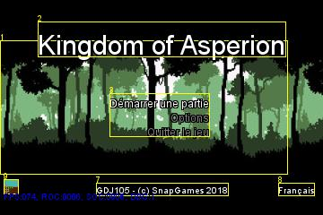
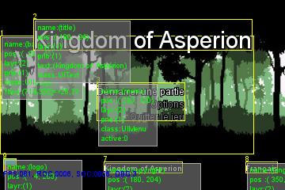
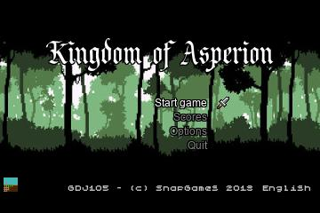
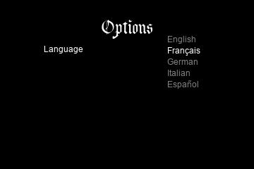
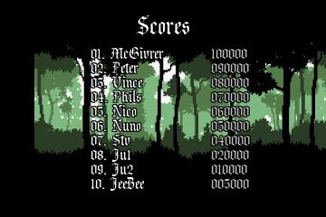
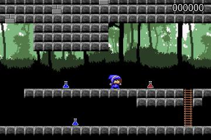
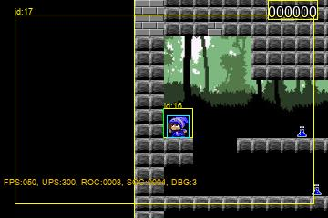

# GDJ105

[](https://travis-ci.org/SnapGames/GDJ105 "open the TravisCI compilation trend")
[](https://app.buddy.works/fredericdelorme/gdj105/pipelines/pipeline/148927)
[](https://app.fossa.io/projects/git%2Bgithub.com%2FSnapGames%2FGDJ105?ref=badge_shield)
[](https://www.codacy.com/project/mcgivrer/GDJ105/dashboard?utm_source=github.com&amp;utm_medium=referral&amp;utm_content=SnapGames/GDJ105&amp;utm_campaign=Badge_Grade_Dashboard)
[](https://github.com/SnapGames/GDJ105/releases/tag/gdj105-1.0.0)

## Game Development Java Basics 105

This project is part of the [gdj105](https://classroom.google.com/c/NzI2ODQ3NjU2MFpa/t/NzI2Nzg0MjgxNFpa) course from [GameDev Basics
Java](https://classroom.google.com/c/NzI2ODQ3NjU2MFpa "Open the official on-line course") 
provided by the [SnapGames](http://snapgames.fr) site. 

### Goal

As we have got now some great piece of game code, we need to start building a real framework by refactoring the code and adding some new objects.
Graphical objects to create some new States : 

Let's create :

- `UIText`, a text object to display some text in a UI,
- `UIImage` an image object to be used in UI ,
- and `UIMenu` a Menu object to manage and display a multi item list of choice.

`UIText` and `UIMenu` can be translated using the message_cc_ll.properties file and dynamically changed with a reload event.

To build a new game state : the `TitleState`.

> **NOTE** <<2018-09-04>>
> 
> As test purpose in this specific git branch [`feature/enhance-tilemap-loading`](https://github.com/SnapGames/GDJ105/tree/feature/enhance-tilemap-loading "open the branch on the GDJ105 github repo"), to prepare development of GDJ10X course, we add new features:
>
> - `ScoreState`to display a fictive list of players with their own High Score, to prepare a next dev where those High Scores are stored in the cloud.
>
> - `PlayState` integrate a TileMap loader and some new GameObject like a `Player`, and `Enemy` and some `MapDescription` and `TileMapDescription` where are deserialized JSON data from the `res/maps/` path, a `Camera` object to track another object, here it will be the Player object, and this camera is contrained to TileMap dimension.
>
> - `OptionState` options menu where user can choose preferred language.
>
## Compile

To compile the full project, please execute the following command :

```bash
$> mvn clean install
```

## Execute

to execute the the compiled jar, please execute the command bellow :

```bash
$> mvn exec:java
```

or :

```bash
$> java -jar gdj105-0.0.1-SNAPSHOT.jar
```

After full build, on the windows platform, you can execute the `target/ GDJ105.exe` executable file.

```bash
c:\> target\GDJ105.exe
```

## Edit

Import this project as an Existing Maven Project into your preferred IDE, 
(like [Eclipse](http://www.eclipse.org/downloads "open the eclipse official web download page") ?)

## Some screen shots

### Title State

Here are some screenshots from the Title screen from the `TitleState`:



This is the main "welcome" screen of the game, this is where the gamer comes in when he starts the game. 

## Debug mode

Some debug information can be displayed according to the debug level you've chosen:

- <kbd>D</kbd> / <kbd>F9</kbd> switch between DEBUG modes 

| Mode  | Description                                                                                        |
|:-----:|:---------------------------------------------------------------------------------------------------|
| **1**	| Only display yellow squares with a numeric id, and display FPS                                     |
| **2**	| Display yellow squares and highlight the moving direction with a green line on the direction side, |
| **3**	| Show full of information in a panel for each active object (default).                              |

### Debug Level 1



### Debug level 3

 

## Switch between Languages

- Use the <kbd>L</kbd> key to switch between available languages:

  - `EN` for English,
  - `FR` for French,
  - `DE` for German,
  - `ES` for Spanish,
  - `IT` for Italian.

# Screenshots

## Take a snapshot

You can at any time push the <kbd>S</kbd> key to take a snapshot.
This JPEG picture screenshot of the game window will be saved to the `~/` directory on linux/ux platform or in the `c:\users\[username]` path on Windows.


## TitleState



## OptionState

 

## ScoreState

 

## PlayState

 

Bonus track, the debug enhanced version :

 

Have Fun !

Send a mail to [SnapGames](mailto:contact@snapgames.fr?subject=gdj105 "send a mail to our team")

## License conformance analysis

[](https://app.fossa.io/projects/git%2Bgithub.com%2FSnapGames%2FGDJ105?ref=badge_large)
