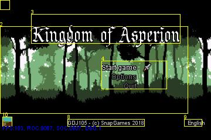
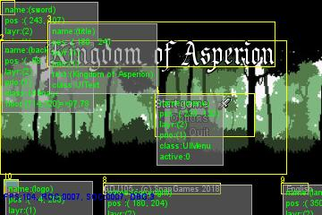
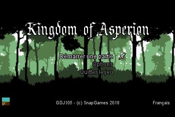

# GDJ105

[](https://travis-ci.org/SnapGames/GDJ105 "open the TravisCI compilation trend")

## Game Development Java Basics 105

This project is part of the [gdj105](https://classroom.google.com/c/NzI2ODQ3NjU2MFpa/t/NzI2Nzg0MjgxNFpa) course from [GameDev Basics
Java](https://classroom.google.com/c/NzI2ODQ3NjU2MFpa "Open the official on-line course") 
provided by the [SnapGames](http://snapgames.fr) site. 

### Goal

As we have got now some great piece of game code, we need to start buildig a real framework by refactoring the code and adding some new objects.
Graphical objects to create some new States : 

Let's create :

- `UIText`, 
- `UIImage` 
- and `UIMenu` 

to build a new game state : the `TitleState`, 

## Compile

To compile the full project, please execute the following command :

```bash
$> mvn clean install
```

## Execute

to execute the the compiled jar, please execute the command bellow :

```bash
$> mvn exec:java
```

or :

```bash
$> java -jar gdj105-0.0.1-SNAPSHOT.jar
```

## Edit

Import this project as an Existing Maven Project into your preferred IDE, 
(like [Eclipse](http://www.eclipse.org/downloads "open the eclipse official web download page") ?)


## Some screen shots ?

### Title State

Here are some screenshots from the Title screen from the `TitleState`:


#### Debug mode

Some debug information can be displayed according to the debug level you've chosen:

- <kbd>D</kbd> / <kbd>F9</kbd> switch between DEBUG modes 

| Mode  | Description                                                                                        |
|:-----:|:---------------------------------------------------------------------------------------------------|
| **1**	| Only display yellow squares with a numeric id, and display FPS                                     |
| **2**	| Display yellow squares and highlight the moving direction with a green line on the direction side, |
| **3**	| Show full of information in a panel for each active object (default).                              |


##### Debug Level 1



##### Debug level 3

 

#### Switch between Languages

- Use the <kbd>L</kbd> key to switch between available languages:
    - <code>EN</code> for English,
    - <code>FR</code> for French,
    - <code>DE</code> for Deutch,
    - <code>ES</code> for Spanish,
    - <code>IT</code> for Italian.




#### Take a snapshot

you can at any time push the <kbd>S</kbd> key to take a snapshot.
This instance jpeg picture of the game window will be saved to the `~/user` directory as a default path.

Have Fun !

Send a mail to [SnapGames](mailto:contact@snapgames.fr?subject=gdj105 "send a mail to your tutor")
