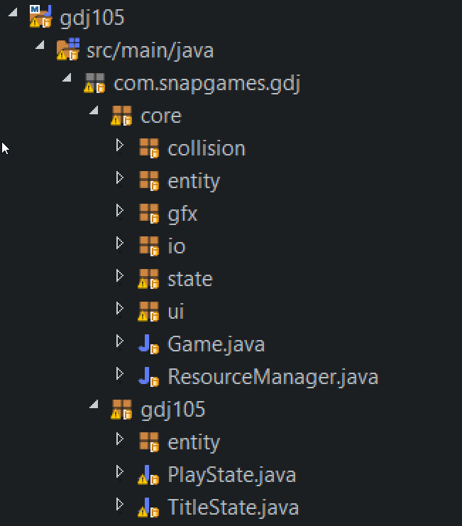
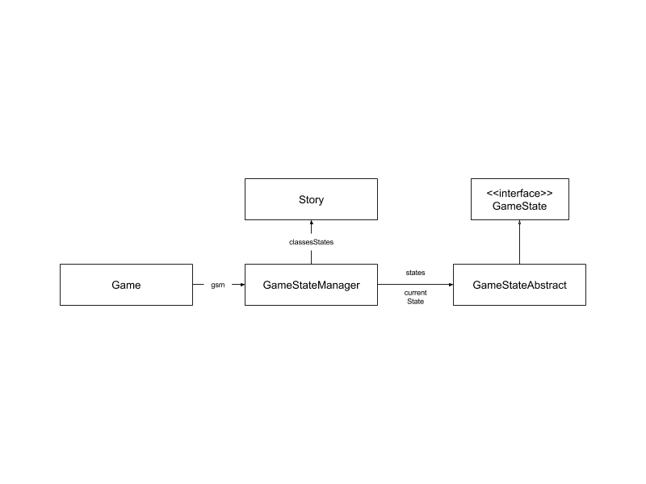
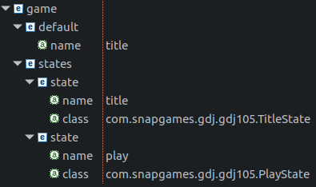
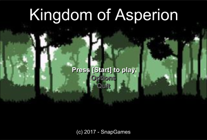
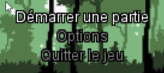

[GDJ105. Resources, UI et i18n]{.c4 .c22} {#h.dena1utqj9jg .c30}
=========================================

[Introduction]{.c5 .c4} {#h.iuekx1uvtxvk .c15}
-----------------------

[Maintenant que nous avons la capacité de créer et gérer plusieurs
états, ou modes, de jeu, nous pouvons nous concentrer sur les objets que
nous allons manipuler. ]{.c2}

Aussi, vous allez spécialiser la fameuse interface
[GameObjet]{.c20}[ ]{.c13}en [UIText]{.c20}, [UIMenu]{.c20}, [UIImage
]{.c20}[pour faire un état de Titre et de menu. ]{.c2}

Vous en profiterez pour réorganiser le code principal de l'exemple
[gdj105 ]{.c20}et le framework de jeu, que nous appellerons
[core]{.c20}[. vous verrez également d'autres concepts au travers de la
gestion de collision.]{.c2}

Oublions un peu notre classe [DemoState]{.c20}[, et passons à des choses
plus sérieuses.]{.c2}

[Organisation du projet]{.c5 .c4} {#h.hahxqxu1mvt9 .c15}
---------------------------------

[Comme mentionné en introduction, il est important de bien structurer
son projet.]{.c2}

[En effet, nous allons devoir commencer à isoler la partie réutilisable
de notre projet  des autres classes servant à de de test. ]{.c2}

La partie réutilisable sera pompeusement appelée "Core Framework" et ces
classes seront regroupées dans [core]{.c13}, et la partie
d'implémentation du jeu lui-même sera le package [gdj105]{.c20}[.]{.c2}

[Ainsi, nous aurons la structure de package suivante:]{.c2}

[]{#t.4d2eaf3e182b2e4b66525d6645696aedd12134a8}[]{#t.0}

+-----------------------------------+-----------------------------------+
| [Package]{.c12 .c4}               | [Description]{.c12 .c4}           |
+-----------------------------------+-----------------------------------+
| [com.snapgames.gdj.core]{.c36     | [l'ensemble des classes qui       |
| .c4}                              | seront identique d'un projet à    |
|                                   | l'autre et donc                   |
|                                   | réutilisable]{.c2}                |
+-----------------------------------+-----------------------------------+
| [com.snapgames.gdj.gdj105]{.c4    | [l'implémentation de notre jeu,   |
| .c36}                             | basée sur le core.]{.c2}          |
+-----------------------------------+-----------------------------------+

[Le projet est maintenant structuré comme présenté ci-dessous:]{.c2}

[]{style="overflow: hidden; display: inline-block; margin: 0.00px 0.00px; border: 0.00px solid #000000; transform: rotate(0.00rad) translateZ(0px); -webkit-transform: rotate(0.00rad) translateZ(0px); width: 209.50px; height: 238.38px;"}

figure 1: [La nouvelle structure de projet, réorganisée.]{.c23 .c13}

Comme vous pouvez le constater, les packages [entity]{.c20}, [io]{.c20},
[state ]{.c20}et [ui ]{.c20}sont maintenant dans sous le package
[core]{.c20}[.]{.c2}

Toutes les classes spécifiques à notre étape 5 (gdj105), enity et les
States du jeu sont dans le package [gdj105]{.c13}[.]{.c2}

Ainsi, dans une prochaine étape, nous pourrons réutiliser l'ensemble des
objets et utilitaires proposés sous le package [core]{.c13}[.]{.c2}

[]{.c12 .c4}

[]{#t.5b54dd57e414d7fbca59146e6130ad3fbcb09fc6}[]{#t.1}

+-----------------------------------+-----------------------------------+
| []{style="o | [Pour lancer n\'importe quelle    |
| verflow: hidden; display: inline- | démo issue de l'un des futurs     |
| block; margin: 0.00px 0.00px; bor | cours, il suffira d\'exécuter la  |
| der: 0.00px solid #000000; transf | classe Game depuis votre IDE.     |
| orm: rotate(0.00rad) translateZ(0 | Comme vous allez le découvrir     |
| px); -webkit-transform: rotate(0. | dans le prochain chapitre, nous   |
| 00rad) translateZ(0px); width: 51 | allons charger les différents     |
| .91px; height: 51.91px;"}         | états du jeu depuis un fichier de |
|                                   | description, lors de              |
|                                   | l\'instanciation de la classe     |
|                                   | Game.]{.c2}                       |
+-----------------------------------+-----------------------------------+

------------------------------------------------------------------------

[]{.c4 .c5} {#h.v72rqlfjjktg .c15 .c35}
-----------

[Fabrique d'état]{.c5 .c4} {#h.3q9p24myqu7e .c15}
--------------------------

[Notre souhait pour ce cours de développement de jeu, est de construire
un framework réutilisable, et adaptable. ]{.c2}

[Aussi, nous avons découvert la technique des états et de la machine à
état qui permet de switcher facilement de l'un à l'autre. Je vous
propose de voir comment ne créer en mémoire (instance) que les états de
jeu nécessaires, et de les conserver dans un cache.]{.c2}

### [Chargement dynamique des états.]{.c27 .c4} {#h.fpexwr5q4vlw .c30}

Nous avons créé une signature de classe [GameState]{.c13}[ pour définir
un contrat (une interface), qui décrit un moyen unique de gérer un état
de jeu. C'est par cette interface que nous allons créer et gérer nos
états.]{.c2}

[]{style="overflow: hidden; display: inline-block; margin: 0.00px 0.00px; border: 0.00px solid #000000; transform: rotate(0.00rad) translateZ(0px); -webkit-transform: rotate(0.00rad) translateZ(0px); width: 602.00px; height: 149.00px;"}

[figure XXX - le schéma des classes du système de gestion des
états.]{.c23 .c13}

[De quoi avons nous besoin ?]{.c2}

[Il nous faudra:]{.c2}

-   un fichier de définition des états du jeu à gérer: [game.xml]{.c12
    .c4}
-   un service de gestion des états: [GameStateManager]{.c4}[,]{.c2}
-   une factory, un constructeur d'état: [GameStateFactory]{.c4}[.]{.c2}

### Le fichier [states.xml]{.c4 .c42} {#h.6d3n87dhfzin .c30}

[il contiendra une liste d'état contenant, nom, classe d'instance, et un
état par défaut, instancier au démarrage du jeu.]{.c2}

[la structure sera définie par une feuille de définition de type de
donnée (DTD) :]{.c2}

[states.dtd]{.c23 .c13}

[  \<?xml version=\"1.0\" encoding=\"UTF-8\"?\>\
 \<!ELEMENT game (default\*, states\*)\>\
 \<!ELEMENT states (state+)\>\
 \<!ELEMENT default EMPTY\>\
 \<!ELEMENT state EMPTY\>\
 \<!ATTLIST state name (CDATA) \#REQUIRED class (CDATA) \#REQUIRED
attributes (CDATA) \#IMPLIED \>\
 \<!ATTLIST default name (CDATA) \#REQUIRED \>]{.c1}

[La première ligne déclare le type de fichier, ici XML.]{.c2}

les lignes suivantes définissant des tag [ELEMENT ]{.c20}[sert à définir
la hiérarchie et la structure de notre fichier.]{.c2}

[Il sera constitué comme indiqué ci-dessous:]{.c2}

un élément principal [GAME ]{.c20}contient un [DEFAULT ]{.c20}ainsi
qu'une liste [STATES ]{.c20}contenant elle même des éléments
[STATE]{.c20}[.]{.c2}

-   [game ]{.c4}[contient la définition de tous les états du jeu et
    celui par défaut:]{.c2}
-   [default]{.c4}[ contient un seul attribut donnant le nom de l'état à
    lancer par défaut,]{.c2}
-   [states]{.c4} contient un liste de [state]{.c4}[.]{.c2}
-   [state]{.c4} ne contient que 2 attributs: le nom ([name]{.c4}) et la
    classe ([class]{.c4}[) d'instanciation de l'état.]{.c2}

[]{style="overflow: hidden; display: inline-block; margin: 0.00px 0.00px; border: 0.00px solid #000000; transform: rotate(0.00rad) translateZ(0px); -webkit-transform: rotate(0.00rad) translateZ(0px); width: 395.00px; height: 234.00px;"}

figure 2: [la structure du fichier game.xml]{.c23 .c13}

Ce fichier sera lu par [GameStateFactory]{.c4}. La gestion des éléments
ainsi créés sera confiée à [GameStateManager]{.c4}[.]{.c2}

[]{.c5 .c4} {#h.1nb92i5lai4z .c15 .c35}
-----------

------------------------------------------------------------------------

[]{.c5 .c4} {#h.acfts0yig2sq .c15 .c35}
-----------

### [GameStateFactory]{.c27 .c4} {#h.3pp01f187tpq .c30}

La
[[factory](https://www.jmdoudoux.fr/java/dej/chap-design-patterns.htm){.c17}]{.c16}[ est
un pattern bien connu. il va nous permettre ici de générer depuis un
fichier de configuration, les instances des états nécessaires pour notre
jeu.]{.c2}

La classe [GameStateFactory ]{.c4}va cacher une autre sous-classe du nom
de [StateDefinition]{.c4}[. Cette classe va comporter tous les attributs
correspondants à ceux présents dans l'élément  STATE du fichier
xml:]{.c2}

[]{#t.76f179b3fb91357b6347971a1737147fd6ee1a63}[]{#t.2}

+-----------------------------------+-----------------------------------+
| [Attribut]{.c4 .c12}              | [Définition]{.c12 .c4}            |
+-----------------------------------+-----------------------------------+
| [name]{.c2}                       | [Un simple nom permettant         |
|                                   | d'identifier autrement que par sa |
|                                   | classe d'instance un état du      |
|                                   | jeu.]{.c2}                        |
|                                   |                                   |
|                                   |                            |
+-----------------------------------+-----------------------------------+
| [class]{.c2}                      | [La classe implémentant l'état de |
|                                   | jeu]{.c2}                         |
|                                   |                                   |
|                                   |                            |
+-----------------------------------+-----------------------------------+
| [attributes]{.c2}                 | [Une liste d'attributs au format  |
|                                   | JSON permettant d'ajouter         |
|                                   | quelques éléments dynamiques de   |
|                                   | configuration à l'état. ce sera   |
|                                   | bien pratique quand il s'agira de |
|                                   | définir plusieurs niveaux ou      |
|                                   | types de jeux.]{.c2}              |
|                                   |                                   |
|                                   |                            |
+-----------------------------------+-----------------------------------+

[figure XXX -  Les attributs de l'élément STATE]{.c23 .c13}

On retrouvera donc l'équivalent de ces attributs XML dans notre sous
classe [StateDefinition]{.c4}[:]{.c2}

[public class StateDefinition {]{.c1}

[        public String name;]{.c1}

[        public String className;]{.c1}

[        public Class\<? extends AbstractGameState\> classState;]{.c1}

[        public String attributes;]{.c1}

[        public JSONObject attrJSON;]{.c1}

[        public boolean defaultFlag;]{.c1}

[        \...]{.c1}

[}]{.c1}

[On trouvera également un simple constructeur :]{.c2}

[public StateDefinition(]{.c1}

[String storyName, ]{.c1}

[String storyClassName, ]{.c1}

[Class\<?\> classState, ]{.c1}

[String attributesState, ]{.c1}

[boolean defaultStateFlag) {]{.c1}

[        this.name = storyName;]{.c1}

[        this.className = storyClassName;]{.c1}

[        this.classState = (Class\<? extends AbstractGameState\>)
classState;]{.c1}

[        this.attributes = attributesState;]{.c1}

[        this.defaultFlag = defaultStateFlag;]{.c1}

[}]{.c1}

Ainsi à la lecture de l'élément dans le fichier XML, on pourra
instancier une sous-classe [StateDefintion]{.c4}[.]{.c2}

### [Lecture du fichier XML]{.c27 .c4} {#h.3rl2acjy86oy .c30}

la lecture et le parcours du fichier XML sera confié au fameux parser
[DocumentBuilderFactory]{.c4} de [javax.xml.parsers]{.c20}[ . ]{.c2}

[Le principe est simple, on passe en entrée du builder un entity
Resolver permettant de définir le chemin de notre DTD:]{.c2}

[db.setEntityResolver(new EntityResolver() {]{.c1}

[  @Override]{.c1}

[  public InputSource resolveEntity(String publicId, String systemId)
throws SAXException, IOException {]{.c1}

[    if (systemId.contains(\"states.dtd\")) {]{.c1}

[      return new
InputSource(GameStateFactory.class.getResourceAsStream(\"/res/dtd/states.dtd\"));]{.c1}

[    } else {]{.c1}

[      return null;]{.c1}

[    }]{.c1}

[  }]{.c1}

[});]{.c1}

[L'entity resolver du parser XML reçoit un System ID issu de la lecture
du fichier XML. Si celui-ci est présent dans le DOCTYPE du document XML,
alors la feuille DTD sera appliquée:]{.c2}

[\<!DOCTYPE story SYSTEM \"states.dtd\"\>]{.c1}

Et dès l'appel de la méthode parse sur un InputStream pointant sur votre
fichier XML, il est alors possible de parcourir le contenu du fichier.
Ce sera le travail de la méthode [readStoryFromXml(InputStream)]{.c4} de
la classe [GameStateFactory]{.c4}[. Vous pourrez d'ailleurs constater
que cette méthode n'est visible que depuis l'intérieur de la classe, car
elle est privée.]{.c2}

En effet, cette méthode est appelée par les méthode [load()]{.c4} et
[load(InputStream)]{.c4}[ qui elles sont publiques.]{.c2}

[- La première propose le chargement des états définis dans un fichier
game.xml,]{.c2}

[- La deuxième laisse le développeur choisir son InputStream en
paramètre. ]{.c2}

Le résultat sera le même dans les deux cas, l'appel de
[readStoryFromXml(InputStream)]{.c13 .c4}[.]{.c23 .c13}

[Regardons de plus près le parsing de ce XML:]{.c2}

[private Map\<String, StateDefinition\> readStoryFromXml(]{.c1}

[InputStream storyXmlInputStream) {]{.c1}

[On définit quelques variables nécessaires au parcours du fichier]{.c2}

[        DocumentBuilder db = null;]{.c1}

[        String stateClass, stateName, attributesState;]{.c1}

[        try {]{.c1}

[On initialise le document parser]{.c2}

[        db =
DocumentBuilderFactory.newInstance().newDocumentBuilder();]{.c1}

[on configure la DTD à appliquer pour valider la structure du
document]{.c2}

[                db = initializeFactory(db);]{.c1}

[Puis on lance le parcours du fichier XML]{.c2}

[                Document doc = db.parse(storyXmlInputStream);]{.c1}

[Récupération de l'élément par défaut]{.c2}

[                NodeList defaultName =
doc.getElementsByTagName(\"default\");]{.c1}

[                Node defaultNameItem = defaultName.item(0);]{.c1}

[                NamedNodeMap defaultAttMap =
defaultNameItem.getAttributes();]{.c1}

[                defaultState =
defaultAttMap.getNamedItem(\"name\").getNodeValue();]{.c1}

[Récupération de tous les éléments de type State]{.c2}

[NodeList list = doc.getElementsByTagName(\"state\");]{.c1}

[listStates = new HashMap\<\>();]{.c1}

[On parcourt les éléments trouvés]{.c2}

[for (int i = 0; i \< list.getLength(); i++) {]{.c1}

[Node item = list.item(i);]{.c1}

[NamedNodeMap attMap = item.getAttributes();]{.c1}

[Pour chaque élément State, on va récupérer le nom, la classe et les
attributs]{.c2}

[stateName = (attMap.getNamedItem(\"name\") != null ?
attMap.getNamedItem(\"name\").getNodeValue() : \"\");]{.c1}

[stateClass = (attMap.getNamedItem(\"class\") != null ?
attMap.getNamedItem(\"class\").getNodeValue() : \"\");]{.c1}

[attributesState = (attMap.getNamedItem(\"attributes\") != null ?
attMap.getNamedItem(\"attributes\").getNodeValue() : \"\");]{.c1}

[Class\<?\> classState = Class.forName(stateClass);]{.c1}

[Une fois tous les attributs identifiés, on ajoute à la liste des
définitions d'états l'instance créée.]{.c2}

[StateDefinition story = new StateDefinition(stateName, stateClass,
classState, attributesState, stateName.equals(defaultState));]{.c1}

[listStates.put(stateName, story);]{.c1}

une petite trace sur le log en mode info, cela ne fait pas de mal:

[logger.info(\"State {} for class has been loaded from configuration
file\", stateName, stateClass);]{.c1}

[}]{.c1}

[Les inévitable catch d'exceptions à tracer en erreur dans le fichier de
log.]{.c2}

[        } catch (SAXException \| IOException \| ClassNotFoundException
\| ParserConfigurationException e) {]{.c1}

[                logger.error(\"Unable to read the game.xml file to
initialize GameState\'s.\",e);]{.c1}

[                System.exit(-1);]{.c1}

[        }]{.c1}

[        return listStates;]{.c1}

[}]{.c1}

Et voilà, à l'issue de la lecture du fichier nous obtenons une liste de
[StateDefinition]{.c4}[ qui serviront à l'instanciation au besoin des
états durant l'exécution du jeu. ]{.c2}

Cette instanciation sera confiée au [GameStateManager]{.c4}[.]{.c2}

[GameStateManager]{.c5 .c4} {#h.jmb7u73yrue5 .c15}
---------------------------

Le gestionnaire d'état de jeu, ou [GameStateManager ]{.c4}va permettre,
de suivant une requête d'activation d'un nom d'état, d'instancier
celui-ci, mais aussi de gérer la délégation des traitements de la boucle
de jeu aux méthodes de l'état ainsi créé (cf. [GameState]{.c4} et
[AbstractGameState]{.c4}[ dans le cours GDJ104 pour les détails de la
machine à état).]{.c2}

[Les modifications apportées à notre GSM sont très ciblées et concernent
l'initialisation du GSM et la méthode d'activation d'un état
particulier, d'une part, mais aussi l'ajout d'un nouvel attribut :]{.c2}

[private GameStateFactory gsf = GameStateFactory.getInstance();]{.c1}

[Ainsi le GSM sera prêt à discuter avec la factory pour l'activation
d'un état.]{.c2}

[public void activate(String name) {]{.c1}

[        if (!states.containsKey(name)) {]{.c1}

[                loadState(name);]{.c1}

[                if (states.containsKey(name)) {]{.c1}

[                        currentState = states.get(name);]{.c1}

[                        currentState.initialize(game);]{.c1}

[                        logger.info(\"State \'{}\' activated with
success\", name);]{.c1}

[                } else {]{.c1}

[                        logger.error(\"Unable to load state \'{}\'\",
name);]{.c1}

[                }]{.c1}

[        }]{.c1}

[}]{.c1}

le chargement d'un état si celui ci n'existe pas déjà dans le cache, est
confié à la méthode [loadState(String)]{.c13}[ :]{.c2}

[public AbstractGameState loadState(String name) {]{.c1}

[        AbstractGameState state = null;]{.c1}

[        try {]{.c1}

On demande à la [GameStateFactory]{.c4} de nous donner le
[StateDefinition]{.c4}[ correspondant au nom passé:]{.c2}

[                StateDefinition stateDef =
gsf.getStateDefintion(name);]{.c1}

[On en crée aussitôt une instance]{.c2}

[                state = stateDef.classState.newInstance();]{.c1}

[                logger.info(\"State named \'{}\' with class \'{}\' has
been instantiated with success\", stateDef.name,
stateDef.className);]{.c1}

[Et si cela ne fonctionne pas, on catch les exceptions pour  logger
l'erreur.]{.c2}

[        } catch (InstantiationException \| IllegalAccessException \|
NoDefaultStateException e) {]{.c1}

[                logger.error(\"Unable to instantiate the class for
state \'{}\'\", name);]{.c1}

[        }]{.c1}

[Si l'état ainsi chargé n'est pas nul, on l'ajoute au cache de états
déjà actifs.]{.c2}

[        if (null != state) {]{.c1}

[                states.put(name, state);]{.c1}

[        }]{.c1}

[Et on retourne la classe ainsi créée.]{.c2}

[        return state;]{.c1}

[}]{.c1}

Une fois l'état étant chargé dans le cache, on l'initialise en appelant
la méthode [GameState\#initialize(Game)]{.c13}[. comme précédemment,
cela n'a pas changé.]{.c2}

[Notre état est alors activé et visible dans l'écran du jeu.]{.c2}

Intéressons nous au premier état d'un jeu, son écran de titre, puis à
son écran de jeu. Il est cependant à noter que l'état de gestion du jeu
sera une adaptation de l'exemple de [GDJ104]{.c13 .c4}[, mais en lui
ajoutant des éléments d'UI, comme un score, des jauges d'énergie et de
mana, ainsi que 2 emplacements d'inventaire qui serviront pour la suite
des cours.]{.c2}

[States]{.c22 .c4} {#h.h5ycj3ya5xex .c30}
==================

[Maintenant que nous avons listé les états à créer et que nous sommes
capable de les charger depuis un fichier, il est grand temps de coder
ces états.]{.c2}

-   [TitleState]{.c4}[ sera l'écran de titre]{.c2}

<!-- -->

-   [PlayState]{.c4}[ sera notre première demo]{.c2}

[TitleState]{.c5 .c4} {#h.db16e4wzkqsy .c15}
---------------------

[C'est l'état qui sera activé au démarrage du jeu, où sera affiché le
titre et le premier menu de démarrage.]{.c2}

[Nous allons partir sur le modèle de design proposé ci-dessous.]{.c2}

[]{style="overflow: hidden; display: inline-block; margin: 0.00px 0.00px; border: 0.00px solid #000000; transform: rotate(0.00rad) translateZ(0px); -webkit-transform: rotate(0.00rad) translateZ(0px); width: 413.00px; height: 280.00px;"}

figure 3: [La page d'affichage du titre du jeu]{.c23 .c13}

[]{.c12 .c4}

[Quelques règles de navigation:]{.c12 .c4}

-   [l'image de fond défilera en permanence.]{.c2}
-   [un appui sur l'une des touches \[UP\] ou \[DOWN\] permet de
    naviguer dans le menu, et les touches \[ESPACE\] ou \[ENTRER\]
    serviront à sélectionner l'option choisie.]{.c2}

<!-- -->

-   ['Press Start to Play']{.c13} lancera le jeu en instanciant l'état
    [PlayState]{.c13}[,]{.c2}
-   ['Options' ]{.c13}[permettra d'accéder à un futur écran de
    configuration du jeu,]{.c2}
-   ['Quit']{.c13}[ permet de quitter le jeu.]{.c2}

[En appuyant sur \[ECHAPPE\] on quitte la demo GDJ105 à tout moment.
]{.c2}

[Cet écran va nous permettre d'aborder trois problématiques inhérentes à
tout jeu:]{.c2}

1.  [la gestion des ressources dans le jeu, comme les images, pour
    l'affichage de l'image animée de fond,]{.c2}
2.  [la traduction des textes affichés, ]{.c2}
3.  [La première interface utilisateur d'un jeu, son écran de titre et
    son menu.]{.c2}

------------------------------------------------------------------------

### [Chargement de ressources]{.c27 .c4} {#h.r27c25tawo8k .c30}

Nous l'avons déjà vu, nous allons avoir quelques ressources à gérer dans
nos démos et dans notre jeu. Aussi, je vous propose un premier principe
de gestion des ressources: le [ResourceManager]{.c13}[. ]{.c2}

[Nous allons établir une règle pour l'ensemble des démos, les ressources
seront toutes présente dans l'arborescence sous '/res' dans les
projets.]{.c2}

[GDJ105]{.c1}

[\|\_\_/src]{.c1}

[    \|\_\_/main]{.c1}

[    \|\_\_/resources]{.c1}

[         \|\_\_/res]{.c1}

[             \|\_\_/images]{.c1}

[             \|   \|\_\_/icon]{.c1}

[             \|\_\_/sound]{.c1}

[             \|\_\_/music]{.c1}

[             \|\_\_/font]{.c1}

[Ainsi, sous le répertoire \`res\`,  nous trouverons:]{.c2}

[]{#t.5802c97cfc79995ee3e216e7bf6eebc4cfd812df}[]{#t.3}

+-----------------------------------+-----------------------------------+
| [Chemins]{.c12 .c4}               | [Description]{.c12 .c4}           |
+-----------------------------------+-----------------------------------+
| [images, images/icon]{.c2}        | [Toutes images ou icônes          |
|                                   | nécessaires au jeu]{.c2}          |
+-----------------------------------+-----------------------------------+
| [sound]{.c2}                      | [Tout son joué durant le          |
|                                   | jeu]{.c2}                         |
+-----------------------------------+-----------------------------------+
| [music]{.c2}                      | [Les musiques du jeu]{.c2}        |
+-----------------------------------+-----------------------------------+
| [font]{.c2}                       | [Des polices de caractères        |
|                                   | (fontes TTF) afin de rendre le    |
|                                   | jeu plus professionnel.]{.c2}     |
+-----------------------------------+-----------------------------------+

Ces ressources seront chargées en tant que InputStream depuis le
[getClass().getInputAsStream()]{.c20}[ de java.]{.c2}

[Regardons de plus près cette classe:]{.c2}

[public class ResourceManager {]{.c1}

[        private static ResourceManager instance = null;]{.c1}

[        private static final Logger logger =
LoggerFactory.getLogger(ResourceManager.class);]{.c1}

[        private Map\<String, Object\> resources = new
ConcurrentHashMap\<\>();]{.c1}

[        private ResourceManager() {]{.c1}

[        }]{.c1}

[\...]{.c1}

[        public static ResourceManager getInstance() {]{.c1}

[                if (instance == null) {]{.c1}

[                        instance = new ResourceManager();]{.c1}

[                }]{.c1}

[                return instance;]{.c1}

[        }]{.c1}

[}]{.c1}

Notre classe de gestion des ressources ne doit exister qu'une seule fois
dans notre jeu. Nous utiliserons le pattern de
[[Singleton](https://www.google.com/url?q=https://fr.wikipedia.org/wiki/Singleton_(patron_de_conception)&sa=D&ust=1534128392948000){.c17}]{.c16}[ pour
la créer et en garder l'instance unique. Je vous laisse découvrir les
subtilité de cela dans wikipédia, mais ici nous en utilisons une version
très simple.]{.c2}

l'instance est conservée dans une attribut [instance]{.c20} privé
statique, le constructeur du [ResourceManager ]{.c4}est lui-aussi privé,
et le seul moyen d'obtenir une instance est d'appeler la méthode
statique et publique, elle, [getInstance()]{.c20}[.]{.c2}

Maintenant que le principe d'instance unique a été appliqué, nous
stockerons toutes les références de nos ressources dans la liste
[resources]{.c13}[.]{.c2}

[Chargeons une ressource depuis un fichier.]{.c2}

[Nous utiliserons l'extension de fichier pour déterminer le type de
ressource. c'est basique mais cela suffira pour nos besoins.]{.c2}

#### [Ajout de ressource]{.c4 .c28} {#h.rwad6cprqkfr .c33}

[En se concentrons nous sur le chargement d'image, nous pouvons filtrer
les fichier ayant un extensions JPG ou PNG et les considérer comme des
ressources de type image.]{.c2}

[private Object addResource(String name) {]{.c1}

[        assert (resources != null);]{.c1}

[        assert (name != null);]{.c1}

[        if (!resources.containsKey(name)) {]{.c1}

[                String extension =
name.substring(name.lastIndexOf(\".\"), name.length());]{.c1}

[                switch (extension) {]{.c1}

[                case \".jpg\":]{.c1}

[                case \".png\":]{.c1}

[                        try {]{.c1}

[                                BufferedImage image =
ImageIO.read(this.getClass().getResourceAsStream(name));]{.c1}

[                                resources.put(name, image);]{.c1}

[                        } catch (IOException e) {]{.c1}

[                                logger.error(\"unable to find resource
for {}\", name);]{.c1}

[                        }]{.c1}

[                        break;]{.c1}

[                }]{.c1}

[        }]{.c1}

[        return resources.get(name);]{.c1}

[}]{.c1}

[Vous pouvez noter que nous ne filtrons pour le moment que les fichier
images, et uniquement sur les extensions qui nous intéresse. mais il
sera facile de charger d'autre type de fichier.]{.c2}

Si l'extension de fichier est JPG ou PNG, nous chargeons le fichier en
tant
qu'[[InputStream](https://docs.oracle.com/javase/8/docs/api/java/io/InputStream.html){.c17}]{.c16},
via la bibliothèque
[[ImageIO](https://docs.oracle.com/javase/8/docs/api/javax/imageio/ImageIO.html){.c17}]{.c16}[ du
JDK.]{.c2}

#### [Demande de ressource]{.c28 .c4} {#h.mmehipg7n1qb .c33}

Ensuite cette ressource de type image est stockée dans la liste
[resources]{.c13}[.]{.c2}

Il nous faut maintenant pouvoir la retrouver dans la liste des
ressources chargées : ce sera la méthode [getImage(String
name)]{.c20}[.]{.c2}

[En voici le listing :]{.c2}

[public static BufferedImage getImage(String name) {]{.c1}

[        return (BufferedImage) getInstance().addResource(name);]{.c1}

[}]{.c1}

On appelle donc notre singleton, et lui demandons de fournir la
ressource name. Le [ResourceManager]{.c4}[ se charge donc le lire le
fichier, le mettre en cache et en retourner l'instance. ]{.c2}

[Si celle-ci existe déjà dans le cache, elle est directement
retournée.]{.c2}

[Nous verrons plus tard comment gérer d'autres types de ressources,
comme des son, des musiques, etc...]{.c2}

[Passons maintenant à l'autre partie intéressante de ce cours, comment
créer une UI de base.]{.c2}

[Internationalisation du jeu (i18n)]{.c5 .c4} {#h.ejnqvjqdubm9 .c15}
---------------------------------------------

[Je suis sur que vous avez peut-être déjà vu le terme de i18n. c'est une
abréviation barbare de 'InternationalisatioN' : 'i' et 'n' sont les
première et dernière lettre du mot, et 18 est le nombre de caractères
qui composent celui-ci. Le copain de i18n et l10n qui signifie, suivant
le même principe 'localisation'.]{.c2}

[Nous allons étudier la mise ne place d'une lecture des messages et
label traduits à afficher, depuis un fichier ultra standard du langage
Java: le fichier de properties.]{.c2}

Ce type de fichier est habituellement chargé depuis un composant Java du
JDK qui s'appelle un
[[ResourceBundle](https://docs.oracle.com/javase/8/docs/api/java/util/ResourceBundle.html){.c17}]{.c16
.c13}[.]{.c2}

[Cet objet pour le tout assez simple, permet:]{.c2}

1.  chargement de ressources textuelles depuis un chemin de type package
    (ex: res.messages permet de charger le fichier
    [messages.properties]{.c13} depuis le path [/res]{.c13}[.]{.c2}
2.  [Le fichier chargé sera celui correspondant à la langue et à la
    locale système. Par exemple:]{.c2}

<!-- -->

1.  en France, le fichier [messages\_FR\_fr.properties]{.c13}[ sera
    chargé, ]{.c2}
2.  alors qu'en anfgleterre, le fichier
    [messages\_EN\_en.properties]{.c13}[ sera utilisé.]{.c2}

[A cette mécanique fournie par défaut, nous ajouterons quelques méthodes
pratiques permettant de fournir des valeurs par défaut, ainsi qu'un
système digestion de paramètres.]{.c2}

[La première méthode offre la possibilité de chercher un message depuis
sa clé dans le fichier de propriétés:]{.c2}

[public static String getString(String key) {]{.c18}

[        try {]{.c18}

[                return RESOURCE\_BUNDLE.getString(key);]{.c18}

[        } catch (MissingResourceException e) {]{.c18}

[                return \'!\' + key + \'!\';]{.c18}

[        }]{.c18}

[}]{.c18}

[]{.c18}

[La seconde méthode propose une valeur de clé à rechercher, et si
celle-ci n'existe pas, une valeur par défaut:]{.c2}

[]{.c18}

[public static String getString(String key, String defaultValue)
{]{.c18}

[        if (RESOURCE\_BUNDLE.containsKey(key)) {]{.c18}

[                return RESOURCE\_BUNDLE.getString(key);]{.c18}

[        } else {]{.c18}

[                return defaultValue;]{.c18}

[        }]{.c18}

[}]{.c18}

[]{.c18}

[Objets]{.c5 .c4} {#h.7vlrwjfp2h3x .c15}
-----------------

[Pour construire ces états, nous allons avoir besoin de nouvelles
briques d'interface utilisateur. c'est ce que je vous propose de mettre
en place maintenant.]{.c2}

La base de tous nos objets sera [AbstractGameObject]{.c13}[.]{.c2}

### [AbstractGameObject]{.c27 .c4} {#h.sqhosxnkb9c8 .c30}

-   [rectangle]{.c2}
-   [collision]{.c2}
-   [attributes]{.c2}
-   [... ]{.c2}

Cette classe implémente un interface [GameObject]{.c13}[ qui va nous
permettre de manipuler l'ensemble des objets du jeu de façon
transparente, sans se soucier de leur fonction exacte.]{.c2}

La class [AbtractGameObject]{.c13}[ sert à amener les comportements par
défaut à l'ensemble des futurs objets, qu'ils soient éléments de
l'interface graphique ou bien personnage de jeu, afficheur de score,
etc...]{.c2}

[C'est un moyen d'abstraction très important dans le fonctionnement de
notre moteur 2D.]{.c2}

Mais pour manipuler tous les objet que nous devons créer, il est
important de ne pas avoir à se soucier du détail des implémentations de
ces objets pour pouvoir les manipuler et les afficher de façon standard.
Pour cela, nous allons mettre en oeuvre une interface qui sera
implémentée par tous les objets: [GameObjet]{.c13}[.]{.c2}

### [GameObject]{.c27 .c4} {#h.3ctdtrv6mv8k .c30}

Regardons donc ensemble de plus près ce que l'interface
[GameObject]{.c13}[ va nous proposer.]{.c2}

[Tout objet que l'on devra manipuler dans notre moteur de jeu doit obéir
à quelques règles communes, et doit donc proposer un certains nombre de
méthodes de base.]{.c2}

[Commençons, par regarder ce que nous devons gérer pour ces
objets:]{.c2}

-   calculer sa nouvelle position, ses nouveaux états, nous le ferons à
    l'aide de la méthode [update(float)]{.c13}[,]{.c2}
-   dessiner cet objet cela sera réalisé via la méthode
    [draw(Graphics)]{.c13}[,]{.c2}
-   retrouver l'objet par son nom avec un fameux
    [getName()]{.c13}[,]{.c2}
-   organiser l'objet afin de le dessiner dans un ordre précis (nous
    verrons cela plus tard) via les méthodes [getPriority()]{.c13} et
    [getLayer()]{.c13}[,]{.c2}
-   [et nous aurons besoin de faire quelques affichages spécifiques afin
    de débugger (oui, car on a beau être de super développeur, on a
    besoin de renfort de temps en temps pour débugger).]{.c2}

<!-- -->

-   [addDebugInfo()]{.c13} pour ajouter une information de
    debuggage[,]{.c13 .c23}
-   [getDebugInfo()]{.c13}[ pour obtenir la liste de toutes les
    informations de débuggage,]{.c2}
-   [isDebugInfoDisplayed()]{.c13}[ permettra de condition l'affichage
    des informations de débuggage]{.c2}
-   [drawSpecialDebugInfo(Game game, Graphics2D g)]{.c13}[ donne la
    possibilité d'implémenter un système de rendu des informations de
    debug spécifique à une implémentation  d'objet.]{.c2}

[Ce qui donnera l'interface suivante :]{.c2}

[public interface GameObject {]{.c1}

[        public void update(Game game, long dt);]{.c1}

[        public void draw(Game game, Graphics2D g);]{.c1}

[        public String getName();]{.c1}

[        public int getLayer();]{.c1}

[        public float getScale();]{.c1}

[        public int getPriority();]{.c1}

[        public void addDebugInfo();]{.c1}

[        public List\<String\> getDebugInfo();]{.c1}

[        public boolean isDebugInfoDisplayed();]{.c1}

[        public void drawSpecialDebugInfo(Game game, Graphics2D
g);]{.c1}

[}]{.c1}

Donc, dans le système, au lieu de manipuler des
[AbstractGameObject]{.c20}, on pourra sans vergogne jouer avec des
[GameObject's]{.c20}[, sans se soucier des implémentations
réelles.]{.c2}

[Et nous allons de ce pas en faire une bonne utilisation en nous
occupant des composants d'interface graphique.]{.c2}

[Composants de l'interface utilisateur (UI)]{.c5 .c4} {#h.kqbiszgpf6em .c15}
-----------------------------------------------------

[Comme nous le découvrons sur la maquette de l'écran de titre, nous
devons afficher plusieurs choses:]{.c2}

-   Le titre du jeu/de la démo ([UIText]{.c20}[),]{.c2}
-   un menu contenant plusieurs items ([UIMenu]{.c20}[),]{.c2}
-   un note de copyright ([UIText]{.c20}[),]{.c2}
-   un image de fond animée d'un scrolling horizontal lent
    ([UIImage]{.c20}[).]{.c2}

[Commençons par écrire un peu de texte.]{.c2}

### [UIText]{.c27 .c4} {#h.zash9zl7h64w .c30}

L'objet ici décrit va nous servir à afficher du texte (sic). Il va donc
hériter de notre [AbstractGameObject]{.c20}[, auquel nous ajouterons 2
propriétés principales qui sont:]{.c2}

-   [le texte à afficher,]{.c2}
-   [la font utilisée pour le rendu de ce texte.]{.c2}

[Et bien sûr, nous allons redéfinir la méthode dessin de cet objet afin
d'en utiliser les nouvelles propriétés.]{.c2}

[public class UIText extends AbstractGameObject {]{.c1}

[Le text à afficher donc :]{.c2}

[        public String text;]{.c1}

[La police de caractères à utiliser pour son rendu graphique]{.c2}

[        private Font writeFont;]{.c1}

[Les quelques couleurs supplémentaires qui vont servir respectivement de
couleur principale]{.c2}

[        private Color frontColor;]{.c1}

[De couleur d'ombre]{.c2}

[        private Color shadowColor;]{.c1}

[La largeur de cette ombre]{.c2}

[        private int shadowBold;]{.c1}

[La couleur de fond pour le cas où il doit y en avoir un]{.c2}

[        private Color backgroundColor;]{.c1}

[La position du texte par rapport à la position de l'objet (x,y)]{.c2}

[        private TextPosition textPosition;]{.c1}

[Un joli constructeur par défaut]{.c2}

[        public UIText() {]{.c1}

[                super();]{.c1}

[                initDefaultValues();]{.c1}

[        }]{.c1}

[Le constructeur de la chained API:]{.c2}

[        public UIText(String name) {]{.c1}

[                super(name, 0, 0, 0, 0);]{.c1}

[                initDefaultValues();]{.c1}

[        }]{.c1}

[un peu d'initialisation des valeurs par défaut]{.c2}

[        protected void initDefaultValues() {]{.c1}

[                text = \"notext\";]{.c1}

[                frontColor = Color.WHITE;]{.c1}

[                backgroundColor = null;]{.c1}

[                this.shadowBold = 1;]{.c1}

[                shadowColor = Color.BLACK;]{.c1}

[        }]{.c1}

[La redéfinition de la méthode de dessin de cet objet]{.c2}

[        @Override]{.c1}

[        public void draw(Game game, Graphics2D g) {]{.c1}

[si la font est spécifiée, on l'applique]{.c2}

[                if (writeFont != null) {]{.c1}

[                        g.setFont(writeFont);]{.c1}

[                }]{.c1}

[on récupère les paramètres de la font en cour d'utilisation]{.c2}

[                FontMetrics fm = g.getFontMetrics();]{.c1}

[                this.width = fm.stringWidth(this.text);]{.c1}

[                this.height = fm.getHeight();]{.c1}

[Si une couleur de background est spécifiée, on trace le dit fond]{.c2}

[                if (backgroundColor != null) {]{.c1}

[                        g.setColor(backgroundColor);]{.c1}

[                        g.fillRect((int) x - 2, (int) y + 2, ]{.c1}

[width + 4, height + 4);]{.c1}

[                }]{.c1}

[On affiche enfin le texte en passant par un helper qui trace texte et
ombre]{.c2}

[                Rectangle rect = RenderHelper.drawShadowString(]{.c1}

[g, text, ]{.c1}

[(int) x, (int) y + height - 2, ]{.c1}

[frontColor, ]{.c1}

[shadowColor,]{.c1}

[                (textPosition != null ? textPosition :
TextPosition.LEFT), ]{.c1}

[shadowBold);]{.c1}

[on calcule la position de l'objet]{.c2}

[                rectangle.x = (int) (rect.x \< rectangle.x ? rect.x :
rectangle.x);]{.c1}

[                rectangle.y = (int) (y);]{.c1}

[on calcule sa taille liée à la font]{.c2}

[                rectangle.width = (int) (rect.width \> width ?
rect.width : width);]{.c1}

[                rectangle.height = fm.getHeight();]{.c1}

[                rectangle.width = width = (fm.stringWidth(text) \>
width ? fm.stringWidth(text) : width);]{.c1}

[        }]{.c1}

[        public void addDebugInfo() {]{.c1}

[                super.addDebugInfo();]{.c1}

[                debugInfo.add(String.format(\"text:(%s)\",
text));]{.c1}

[        }]{.c1}

[        ...]{.c1}

[On fera abstraction de tous les setters liés à l'API de type
chainée.]{.c2}

[}]{.c1}

[Nous avons ajouté un peu de piment à cet objet en proposant une
fonction de centrage du texte par rapport à la position de celui-ci:
]{.c2}

-   [centré, ]{.c2}
-   [centré à gauche ]{.c2}
-   [centré à droite, ]{.c2}

c'est ce que nous appellerons la [TextPosition]{.c13}[. cette dernière
est une énumération:]{.c2}

[        public enum TextPosition {]{.c1}

[                LEFT, ]{.c1}

[RIGHT, ]{.c1}

[CENTER]{.c1}

[        }]{.c1}

Cet énumération est déclaré dans la classe [RenderHelper]{.c13} car elle
n'est pas spécifique au  UI[Text]{.c13}[.]{.c2}

[Un exemple d'utilisation issu du TitleState:]{.c2}

[Nous  choisissons une police de caractères pour le rendu]{.c2}

[Font titleFont = game.getGraphics()]{.c1}

[.getFont()]{.c1}

[.deriveFont(3.0f \* Game.SCREEN\_FONT\_RATIO);]{.c1}

[Nous récupérons le texte traduit à afficher]{.c2}

[String titleLabel =
Messages.getString(\"TitleState.label.title\");]{.c1}

[UIText titleText = (UIText) new UIText(\"title\")]{.c1}

[        .setText(titleLabel)]{.c1}

[        .setFont(titleFont)]{.c1}

[        .setTextAlign(TextPosition.CENTER)]{.c1}

[        .setPosition((int) (Game.WIDTH) / 2, (int) (Game.HEIGHT \*
0.10f))]{.c1}

[        .setLayer(1)]{.c1}

[        .setPriority(1)]{.c1}

[        .setColor(Color.WHITE);]{.c1}

[Ce qui va nous donner le rendu suivant :]{.c2}

[]{style="overflow: hidden; display: inline-block; margin: 0.00px 0.00px; border: 0.00px solid #000000; transform: rotate(0.00rad) translateZ(0px); -webkit-transform: rotate(0.00rad) translateZ(0px); width: 602.00px; height: 81.33px;"}

figure 4: [UIText servant au rendu du titre dans l'état
TitleState.]{.c23 .c13}

### [UIMenu]{.c4 .c27} {#h.ytz2k434wmcp .c30}

Le [UIMenu ]{.c20}peut-être considéré comme une extension du
[UIText]{.c20}[. Celui-ci va permettre d'afficher une liste de textes
sur des lignes différentes, et pas une mécanique de surbrillance la
possibilité de choisir la ligne à sélectionner, permettre le choix par
l'utilisateur d'une des propositions.]{.c2}

[L'objet retourne une valeur numérique correspondante à la ligne
sélectionnée.]{.c2}

Chaque ligne sera en fait un sous objet appelé [UIMenuItem]{.c20}[, cet
objet contenant ]{.c2}

-   [un id unique,]{.c2}
-   [une clé de texte traduit,]{.c2}
-   [le texte à afficher, ]{.c2}
-   [la valeur de sélection.]{.c2}

[UIMenuItem ]{.c20}est une sous-classe de [UIMenu]{.c20}[.]{.c2}

[        public class UIMenuItem {]{.c1}

[Un ID unique pour cet Item]{.c2}

[                private int id;]{.c1}

[un label à afficher]{.c2}

[                private String label;]{.c1}

[une clé de traduction pour ce label]{.c2}

[                private String labelKey;]{.c1}

[la valeur sélectionnée]{.c2}

[                private String value;]{.c1}

le constructeur paramétré pour initialiser en une seule fois tous les
attributs de l'objet

[                public UIMenuItem(int id, String labelKey, String
value, String defaultText) {]{.c1}

[                        this(id, labelKey, value, defaultText,
(Object\[\]) null);]{.c1}

[                }]{.c1}

[LE constructeur qui initialize les attributs en récupérant
l\'éventuelle clé de traduction et sa traduction dans le fichier
messages.properties, dans la langue active bien sûr.]{.c2}

[                public UIMenuItem(int id, String labelKey, String
value, String defaultText, Object\... args) {]{.c1}

[                        this.labelKey = labelKey;]{.c1}

[                        this.value = value;]{.c1}

[                        String translatedLabel =
Messages.getString(labelKey);]{.c1}

[                        if (translatedLabel.contains(labelKey) &&
defaultText != null && !defaultText.equals(\"\")) {]{.c1}

[                                this.label = defaultText;]{.c1}

[                        } else {]{.c1}

[                                this.label =
String.format(translatedLabel, args);]{.c1}

[                        }]{.c1}

[                        this.id = index++;]{.c1}

[                }]{.c1}

[On finit par une succession de setters et getters qui ne sera pas
intéressante à décrire ici.]{.c2}

[                \...]{.c2}

[        }]{.c1}

[Maintenant que nous avons les items de notre menu, passons à sa
gestion.]{.c2}

[public class UIMenu extends AbstractGameObject {]{.c1}

Outre les attributs de couleur et de font qui sont relativement
similaires à ceux du [UIText]{.c20}[, intéressons nous aux
particularités.]{.c2}

[\...]{.c1}

[Tout d'abord, un attribut indiquant l'item actif.]{.c2}

[        private int activeItem = 0;]{.c1}

[La liste des items pour ce menu]{.c2}

[        private List\<UIMenuItem\> items = new ArrayList\<\>();]{.c1}

[Un concepteur qui permet de passer des argument au text du label
traduisible]{.c2}

[public UIMenuItem addItem(String value, String labelKey, String
defaultText, Object\... args) {]{.c1}

[        UIMenuItem item = new UIMenuItem(index++, labelKey, value,
defaultText, args);]{.c1}

[        items.add(item);]{.c1}

[        return item;]{.c1}

[}]{.c1}

La méthode de rendu est quelque peu différente de celle du [UIText
]{.c20}[car elle va parcourir la liste des items et mettre en
surbrillance celui qui est actif:]{.c2}

[@Override]{.c1}

[public void draw(Game game, Graphics2D g) {]{.c1}

[        g.setFont(menuFont);]{.c1}

[        FontMetrics fm = g.getFontMetrics();]{.c1}

[        height = 0;]{.c1}

[        int i = 0;]{.c1}

[        Color drawColor = color;]{.c1}

[        for (UIMenuItem item : items) {]{.c1}

[                if (i != activeItem) {]{.c1}

[                        drawColor = Color.GRAY;]{.c1}

[                } else {]{.c1}

[                        drawColor = color;]{.c1}

[                }]{.c1}

[                Rectangle rect = RenderHelper.drawShadowString(g,
]{.c1}

[item.getLabel(), ]{.c1}

[(int) x, (int) y + (i \* fm.getHeight()),]{.c1}

[                        drawColor, shadowColor, ]{.c1}

[(textPosition != null ? textPosition : TextPosition.LEFT), 2);]{.c1}

[                i++;]{.c1}

[                // update rectangle Bounding Box for this object.]{.c1}

[                rectangle.x = (int) (rect.x \< rectangle.x ?
rect.x]{.c1}

[: rectangle.x);]{.c1}

[                rectangle.y = (int) (y - fm.getHeight());]{.c1}

[                rectangle.width = (int) (rect.width \> width ?
rect.width ]{.c1}

[: width);]{.c1}

[                rectangle.height = i \* fm.getHeight();]{.c1}

[                rectangle.width = width = ]{.c1}

[(fm.stringWidth(item.getLabel()) \> width ]{.c1}

[? fm.stringWidth(item.getLabel())]{.c1}

[                                        : width);]{.c1}

[        }]{.c1}

[}]{.c1}

[Enfin, quelques méthodes qui vont permettre d'activer et naviguer dans
la liste des items de ce menu:]{.c2}

[        public void activate(int itemId) {]{.c1}

[                assert (activeItem \< 0);]{.c1}

[                assert (activeItem \>= items.size());]{.c1}

[                this.activeItem = itemId;]{.c1}

[        }]{.c1}

[Revenir à l\'item précédent ou au dernier si nous sommes au début de la
liste]{.c2}

[        public void previous() {]{.c1}

[                activeItem\--;]{.c1}

[                if (activeItem \< 0) {]{.c1}

[                        activeItem = items.size() - 1;]{.c1}

[                }]{.c1}

[        }]{.c1}

[Passer à l'item suivant ou au premier si l'on arrive en fin de
liste]{.c2}

[        public void next() {]{.c1}

[                activeItem++;]{.c1}

[                if (activeItem \>= items.size()) {]{.c1}

[                        activeItem = 0;]{.c1}

[                }]{.c1}

[        }]{.c1}

[Et pour invoquer cet objet, l'exemple suivant donne une idée
d'instanciation.]{.c2}

[On initialise l\'objet menu, conteneur des items]{.c2}

[menu = (UIMenu) new UIMenu(\"menu\")]{.c1}

[        .setActiveItem(0)]{.c1}

[        .setShadowColor(Color.BLACK)]{.c1}

[        .setAlignText(TextPosition.CENTER)]{.c1}

[        .setFont(menuItemFont)                                ]{.c1}

[        .setPosition((int) (Game.WIDTH \* 0.50f), (int) (Game.HEIGHT \*
0.50f))]{.c1}

[        .setLayer(2)]{.c1}

[        .setPriority(1)]{.c1}

[.setColor(Color.WHITE);]{.c1}

[On ajoute les items]{.c2}

[menu.addItem(\"start\", \"TitleState.label.start\", \"Start\");]{.c1}

[menu.addItem(\"options\", \"TitleState.label.options\",
\"Options\");]{.c1}

[menu.addItem(\"quit\", \"TitleState.label.quit\", \"Quit\");]{.c1}

[Le rendu visuel sera le suivant :]{.c2}

[]{style="overflow: hidden; display: inline-block; margin: 0.00px 0.00px; border: 0.00px solid #000000; transform: rotate(0.00rad) translateZ(0px); -webkit-transform: rotate(0.00rad) translateZ(0px); width: 273.00px; height: 122.00px;"}

figure 5: [Rendu de l'objet UIMenu avec le premier item du menu en
surbrillance]{.c23 .c13}

[Passons à un affichage d'image en fond d'écran.]{.c2}

### [UIImage]{.c27 .c4} {#h.8eyjbfubndm7 .c30}

[TODO]{.c2}

